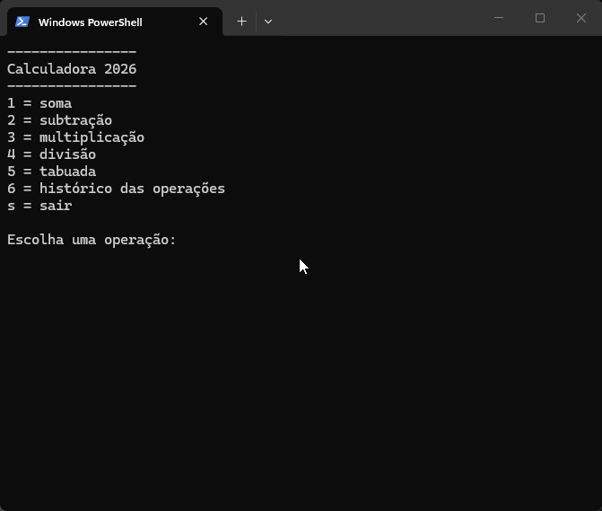

# Calculadora 2026 (ADP)



## Introdução
Calculadora feita em C# no VSCode na Academia do Programador, turma 2026. Simples mas eficaz.

## Funcionalidades
- **Operações básicas:** soma, subtração, multiplicação e adição;

- **Tabuada:** gerada conforme número informado;

- **Histórico:** registro das operações mais recentes;

- **Divisão:** implementação de números divididos por zero com mensagem de erro apropriada

## Como utilizar o programa
1. Clone o repositório ou baixe o código em .zip;

2. Abra o emulador de terminal e navegue até a pasta raiz;

3. Utilize o comando abaixo para restaurar as depêndencias do projeto;
```
dotnet restore
```
4.Em seguida compile e execute o projeto com o comando:
```
dotnet run --project Calculadora.ConsoleApp
```
## Requesitos
- .NET SDK 10.0